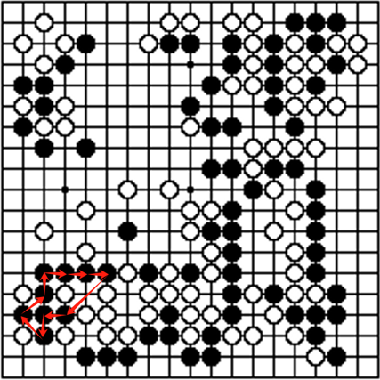
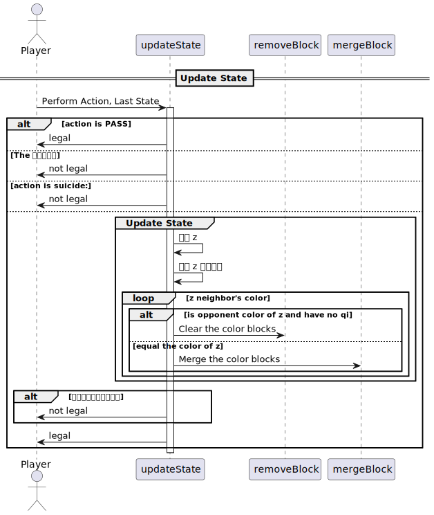
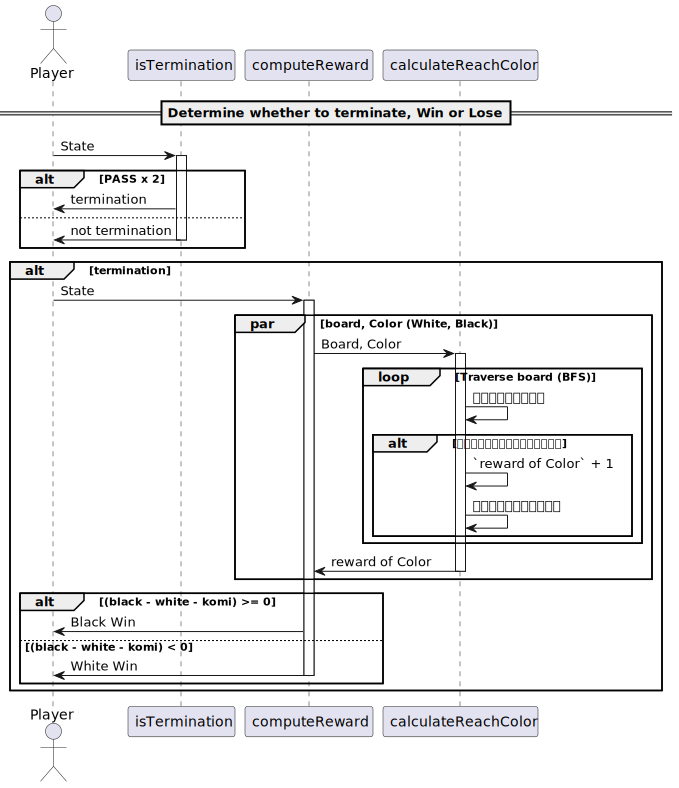

# Implementation of Go

[TOC]

## Define

The definition of Go: [Go](./Go.md)

## Implementation

### State
- **Player**: Indicates the current player's color, witch can be: (1) Black. (2) White.
- **Board**: Represents the game bord, modeled as an $n \times n$ matrix. Each element in the matrix can be one of the following:  (1) Black. (2) White. (3) Empty.
- **Action**: Refers to the available moves a player can take, which include:
  1. **PASS**: Skip the current turn.
  2. **Position on the Board**: Place a piece at a specific location on the board.
- **Connected Regions**: The records of the connected regions in the board, which modeled as closed loops.
  - **Connected Group Map**: A connectivity Map that assigns as an index to each connect group of the same color, identifying its territory. The index also corresponds to the head position of any closed loops within the group.
  - **Next Map**: A successor mapping used to identify the next piece in a connected group of the same color. This allows easy traversal of the entire connected region for the closed loops.
  - **Qi**: A mapping that records the number of liberties (open adjacent points) for each connected group's index.

- **History States**: A collection of all previous board states.

#### Termination

twice `PASS` to termination the game.

#### Zobrist Hash

Zobrist hashing is to efficiently compute unique hash values representing different board states.

- Zobrist Table, is a 2D array that holds precomputed random 64-bit numbers. Each entry in this table corresponds to a unique combination of a board position and a possible state.

- Compute the Zobrist Hash, compute the current hash value based on a change at a specific board position and color (state).

  - **Adding a Piece**: XOR the hash with the random number corresponding to the `(position, state)` pair.
  - **Removing a Piece**: XOR the hash again with the same random number, effectively removing its influence from the hash.

  $$
  v = v ⊕ table_{Zobrist}(position, color);
  $$

### Action

#### Pass

跳过该局

#### Disable global isomorphism

检查当前传入的状态 state 的棋盘的zobrist hash 值，是否在历史上同一棋手处存在过。

#### Not allow suicide

### $S_t \overset{A_t}{\rightarrow} S_{t+1}$

#### Remove stone block with no Qi

输入要删除的连通块的序号，遍历块的颜色将其改为空点，并且将周围的块的气加一。

#### Merge stone block

输入两个连通块的序号，也是头位置，遍历块1的颜色都改为块2序号，并看周围空点是否为块1、2的共用空点，如果不是，块2的气加一. 最后交换两个头的后继，合并为1个连通块。

### Reward

#### Score: Number of spaces reachable

1. 函数`calculateReachColor`接收两个参数：一个颜色数组`board`和一个表示特定颜色的整数`color`。`BOARD_COLOR_NUM`是一个预定义的常量，表示`board`数组的大小。
2. `reachable`变量初始化为0，它用于记录可达的空格数量。
3. `bd`是一个布尔类型的向量，初始化所有元素为`false`，用于标记网格中的每个位置是否已经被访问过。
4. `open`是一个队列，用于进行宽度优先搜索（BFS）。
5. 第一个`for`循环遍历游戏板上的所有位置。如果某个位置的颜色与给定的颜色相同，这个位置就被认为是可达的，`reachable`会增加，相应的`bd`数组位置会被标记为`true`，并且该位置会被加入到`open`队列中。
6. 接下来的`while`循环是一个宽度优先搜索，用于找到所有从起始颜色出发可达的`EMPTY`（未被占据的）位置。这个循环会一直进行，直到没有更多的位置需要检查。
7. 在循环内部，它取出队列`open`的前端元素，代表当前正在检查的位置。
8. 接着，内部的`for`循环遍历该位置的四个相邻位置（由`adj_x`和`adj_y`数组给出的偏移量表示）。对于每个相邻位置，计算新的`xt`和`yt`坐标，以及`vt`，即该位置在`board`数组中的索引。
9. 如果计算出的相邻位置坐标在棋盘内，并且该位置未被访问过，同时位置颜色为`EMPTY`，则将其标记为已访问，并将该位置的索引加入到`open`队列中。
10. 最后，函数返回`reachable`的值，即从给定颜色出发，可以到达的`EMPTY`位置的总数。

#### Win or loss calculation (Komi)

		float komi = 7.5;
	
		auto white = calculateReachColor(s.board, WHITE);
		auto black = calculateReachColor(s.board, BLACK);
		return (black - white - komi) >= 0 ? BLACK : WHITE;
